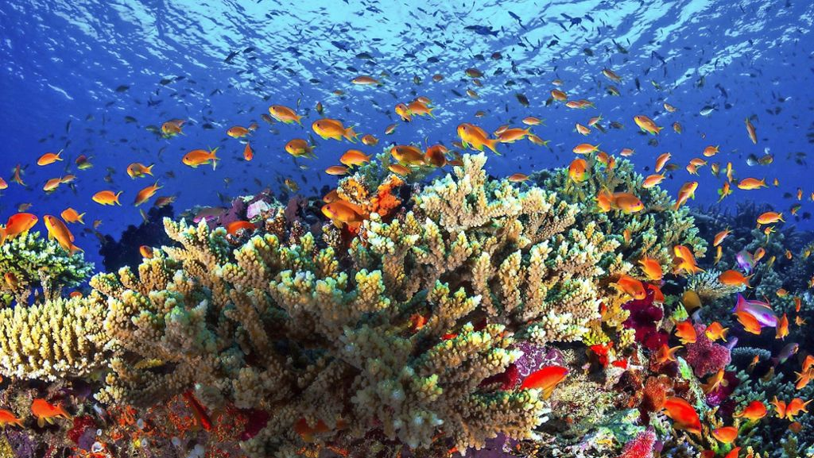

### Hi there 👋, it's me

# Joachim Ritter
Journalist, manager, creator of opportunities, currently learning website coding.

I have been a journalist and publisher for 40 years and currently learning full stack webdesign at the Digital Carrer Institute in Germany. I like to learn all about the possibilities of publishing and communicating online. My goal for the future is to find new ways of publishing including 
- contents
- economy
- marketing

Therefore I do have some concrete ideas and strong believes. 

### My career in brief --> where I come from
- Learning at Bertelsmann/GER economy and journalism for trade magazines
- establishing my own publishing comany, working internationally for 25 years
- in the field of professional lighting design in architecture --> PLD magazine

    

- initiator and co-founder of the Professional Lighting Designers' Association, including management and finances
- developer and organiser of more than 50 international practical workshops in lighting design in public spaces
- creator of the largest convention on lighting design wordwide with more than 2000 international attendees each event
- project developer for museums, public and private

- currently learning full stack web development front- and backend.

### My strengths are 
- conceptional and strategic work
- creativity
- future oriented thinking
- multitalented
- bilingual --> German and English
- experienced
- direct and honest

### I have (basic or solid) knowledge in

    
    
    
    
    
    
    
  <!--  -->

      

### I also know about
- Microsoft Office including backend programming in Access
- bookkeeping in Lexware
- publishing software: QuarkXpress, Adobe Indesign
- Adobe cloud programs, especially Photoshop, Lightroom, Premiere
- webdesign using VS Code
- fast webdesign using Wix
- marketing and strategy
- photography and using picture design tool

    

### Where I see my future?
When there is something new to be developed I am willing to spend my energy and contribute.

### Before you start searching in facebook...
- I have humor
- I was born in 1962
- I enjoy sport like skiing, speedminton, football, table tennis
- I enjoy gardening, learning about new topics, discussing politics and human beings
- I can make compromises, except with Putin.
- I prefer Norway and/or Canada more than Mallorca partyzone and beach holidays
- driving a Z4 in Norway
- my experience I like to remember most: rafting in Norway and Australia, diving (Great Barrier Reef), skiing in Lake Louise/CDN and of course

jritter@via-internet.com

PS. Why Kazhim Rycerz? Rycerz is the Polish translation for 'Ritter' (my father's origin) and 'Kazhim' is the combination of **Kaz**hal and Joac**him**, the creators of 'Kazhim' and best combination of both kids, Kazhim and Achal.
